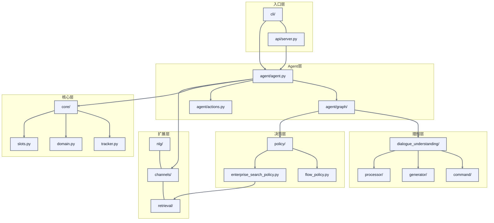
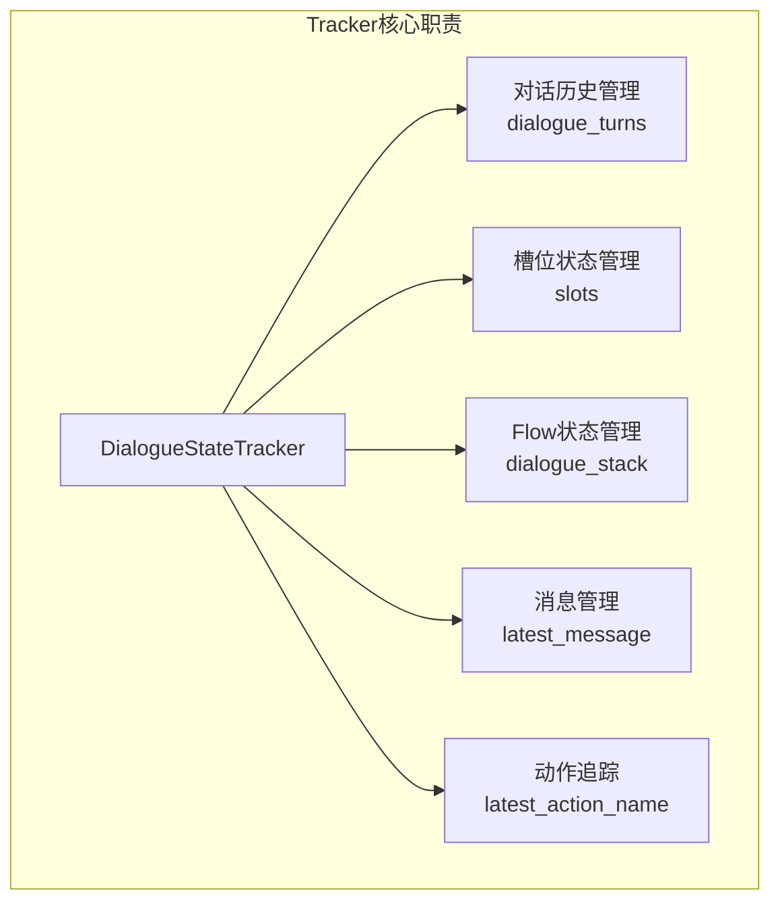
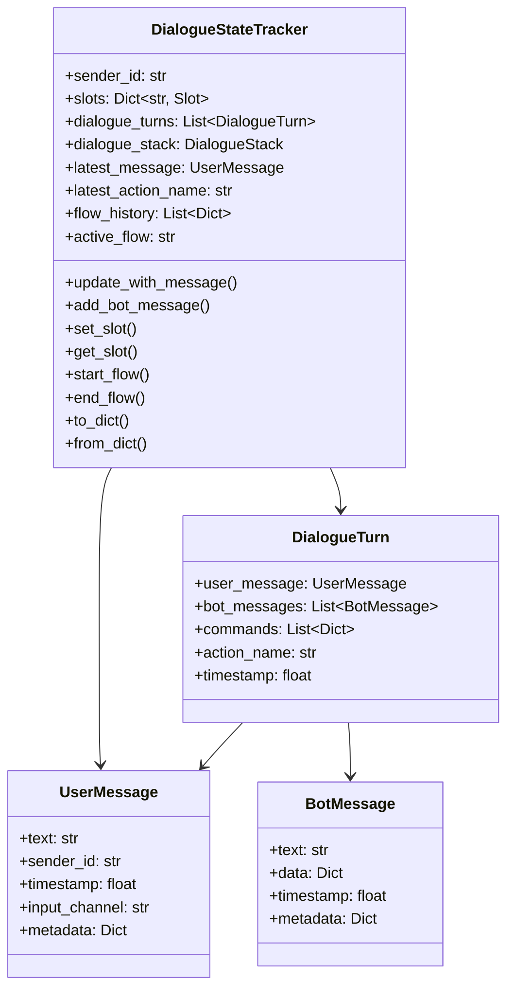
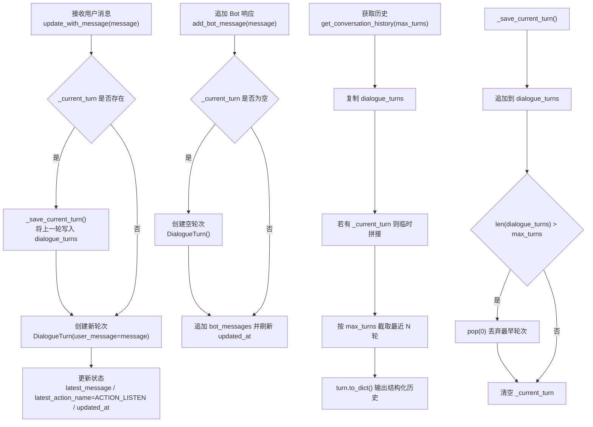
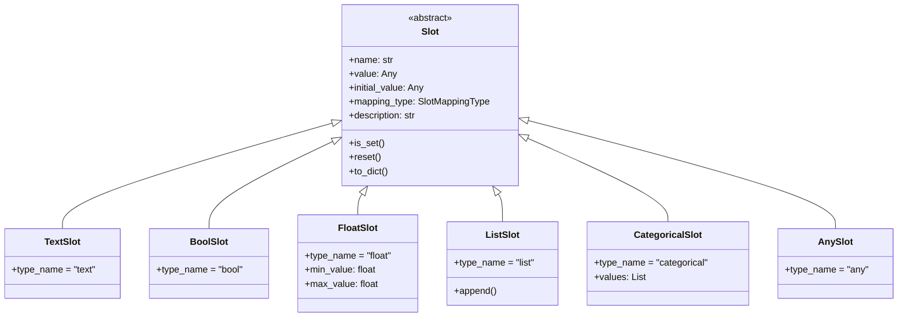

# 一、CustomerServiceAgent 项目架构

## 详细目录结构（规划）

```text
├── api/                    # 核心框架
│   ├── __init__.py
│   ├── __main__.py                # CLI入口
│   │
│   ├── agent/                     # Agent模块
│   │   ├── agent.py               # Agent主类
│   │   ├── actions.py             # 动作系统
│   │   ├── message_processor.py   # 消息处理器
│   │   └── graph/                 # LangGraph编排
│   │       ├── builder.py         # 图构建器
│   │       ├── state.py           # 状态定义
│   │       ├── edges.py           # 条件边
│   │       └── nodes/             # 节点实现
│   │           ├── understand.py  # 理解节点
│   │           ├── policy.py      # 策略节点
│   │           ├── action.py      # 动作节点
│   │           ├── guard.py       # 保护节点
│   │           └── response.py    # 响应节点
│   │
│   ├── core/                      # 核心模块
│   │   ├── tracker.py             # 对话状态追踪器
│   │   ├── domain.py              # 领域定义
│   │   ├── slots.py               # 槽位系统
│   │   └── stores/                # 存储实现
│   │       ├── tracker_store.py   # 存储接口
│   │       ├── json_store.py      # JSON存储
│   │       └── mysql_store.py     # MySQL存储
│   │
│   ├── dialogue_understanding/    # 对话理解模块
│   │   ├── commands/              # 命令系统
│   │   │   ├── base.py            # 命令基类
│   │   │   ├── flow_commands.py   # Flow命令
│   │   │   ├── slot_commands.py   # 槽位命令
│   │   │   ├── answer_commands.py # 回答命令
│   │   │   └── session_commands.py# 会话命令
│   │   │
│   │   ├── generator/             # 命令生成
│   │   │   ├── llm_generator.py   # LLM生成器
│   │   │   ├── prompt_builder.py  # Prompt构建
│   │   │   └── command_parser.py  # 命令解析
│   │   │
│   │   ├── processor/             # 命令处理
│   │   │   └── command_processor.py
│   │   │
│   │   ├── stack/                 # 对话栈
│   │   │   ├── dialogue_stack.py  # 栈实现
│   │   │   └── stack_frame.py     # 栈帧定义
│   │   │
│   │   └── flow/                  # Flow系统
│   │       ├── flow.py            # Flow定义
│   │       ├── flow_loader.py     # Flow加载
│   │       └── flow_executor.py   # Flow执行
│   │
│   ├── policies/                  # 策略模块
│   │   ├── base_policy.py         # 策略基类
│   │   ├── flow_policy.py         # Flow策略
│   │   ├── enterprise_search_policy.py  # 搜索策略
│   │   └── policy_ensemble.py     # 策略集成
│   │
│   ├── nlg/                       # 自然语言生成
│   │   ├── nlg_generator.py       # NLG基类
│   │   ├── template_nlg.py        # 模板NLG
│   │   └── response_rephraser.py  # 响应重述
│   │
│   ├── channels/                  # 通道模块
│   │   ├── base_channel.py        # 通道基类
│   │   ├── rest_channel.py        # REST通道
│   │   ├── socketio_channel.py    # WebSocket通道
│   │   └── console_channel.py     # 控制台通道
│   │
│   ├── retrieval/                 # 检索模块
│   │   ├── base_retriever.py      # 检索器基类
│   │   ├── embedder.py            # 向量嵌入
│   │   └── flow_retriever.py      # Flow检索
│   │
│   ├── api/                       # API模块
│   │   └── server.py              # FastAPI服务
│   │
│   ├── cli/                       # 命令行工具
│   │   ├── __init__.py            # CLI入口
│   │   ├── init.py                # 初始化命令
│   │   ├── run.py                 # 运行命令
│   │   ├── train.py               # 训练命令
│   │   ├── shell.py               # 交互Shell
│   │   └── inspect.py             # 调试命令
│   │
│   ├── training/                  # 训练模块
│   │   ├── trainer.py             # 训练器
│   │   ├── model_storage.py       # 模型存储
│   │   └── finetune/              # 微调
│   │
│   └── shared/                    # 共享工具
│       ├── config.py              # 配置管理
│       ├── constants.py           # 常量定义
│       ├── exceptions.py          # 异常定义
│       ├── yaml_loader.py         # YAML加载
│       └── llm/                   # LLM客户端
│           ├── base_client.py     # 客户端基类
│           └── langchain_client.py# LangChain客户端
│
├── ecs_demo/                      # 电商客服示例
│   ├── config.yml                 # 配置文件
│   ├── endpoints.yml              # 端点配置
│   ├── data/
│   │   └── flows/                 # Flow定义
│   ├── actions/                   # 自定义Action
│   └── addons/                    # 扩展功能
│
├── docs/                          # 文档目录
├── reference/                     # 参考资料
├── setup.py                       # 安装配置
└── requirements-atguigu.txt       # 依赖列表
```

## 模块关系图




## 二、对话状态管理（Tracker模块）

### 2.1 Tracker设计架构




### 2.2 数据结构

`类图`




### 2.3 实现逻辑

`DialogueStateTracker` 当前通过 `dialogue_turns`（已完成轮次）和 `_current_turn`（进行中轮次）两段式结构管理多轮对话，核心流程如下：



这套机制实现了“上一轮封存 + 当前轮累积 + 窗口化返回”的多轮对话管理策略。


## 三、槽位系统

### 3.1 槽位类型

`槽位(Slot)` 是对话系统中用于存储收集信息的容器



| 类型                | 说明   | 验证规则       | 示例     |
| ----------------- | ---- | ---------- | ------ |
| `TextSlot`        | 文本槽位 | 必须是字符串     | 订单号、地址 |
| `BoolSlot`        | 布尔槽位 | 必须是布尔值     | 是否确认   |
| `FloatSlot`       | 数值槽位 | 必须是数字，可设范围 | 金额、数量  |
| `ListSlot`        | 列表槽位 | 必须是列表      | 商品列表   |
| `CategoricalSlot` | 分类槽位 | 必须在预定义值中   | 支付方式   |
| `AnySlot`         | 任意槽位 | 接受任何值      | 通用存储   |

`槽位的映射类型`
 
- 用户消息（UserMessage）
- Bot响应列表（List[BotMessage]）
- 生成的命令（commands）
- 执行的动作名称（action_name）

## Docker 生产部署

```bash
# 1) 复制环境变量模板
cp .env.example .env

# 2) 构建并启动（生产依赖）
docker compose -f docker-compose.prod.yml up -d --build

# 3) 查看日志
docker compose -f docker-compose.prod.yml logs -f
```

说明：

- 镜像内使用 `uv sync --frozen --no-dev`，仅安装生产依赖并严格锁定 `uv.lock`。
- 容器默认使用非 root 用户运行，降低安全风险。
- 当前默认启动命令为 `csa`；接入 FastAPI 后可改为 `uvicorn ...`。
- 请将 `.env` 中的密钥改为云平台 Secret 注入，不要提交到仓库。

